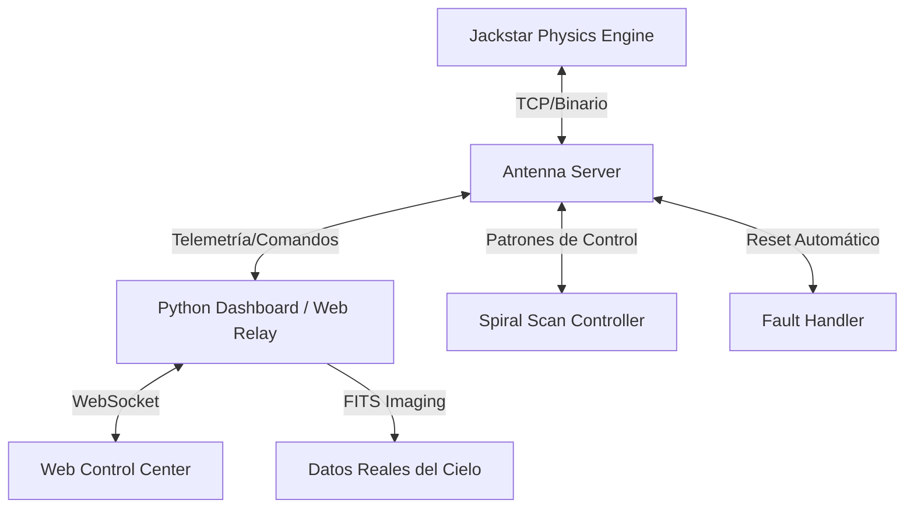

# Jackstar Observatory 📡✨

Un simulador de matriz de radiotelescopios de alto rendimiento desarrollado en C++ y Python. Este proyecto simula los sistemas de control, protocolos de red y visualización de datos utilizados en observatorios astronómicos profesionales como ALMA.

## Características Principales 🚀

- **Jackstar Engine (C++)**: Simulación realista de una matriz de 50 antenas con inercia, aceleración y perfiles de velocidad trapezoidales.
- **Protocolo TCP/IP Personalizado**: Capa de red binaria para el envío eficiente de comandos y recuperación de telemetría.
- **Web Control Center**: Interfaz web de alta fidelidad y tiempo real (sin dependencias de Node.js) para monitorear la salud del array.
- **Control PID**: Sistema de control Proporcional-Integral-Derivado para contrarrestar perturbaciones ambientales (viento).
- **Simulación de Interferometría**: Generación de señales complejas en tiempo real (Fase/Amplitud) y visualización de líneas de base en el plano UV.
- **Mantenimiento con IA**: Detección de anomalías mediante sensores de temperatura y corriente para predecir fallas de hardware.

## Arquitectura 🏛️



## Guía de Inicio 🛠️

### Prerrequisitos
- **C++**: GCC/MinGW-w64 (soporte para C++17)
- **Python 3.12+**: `matplotlib`, `astropy`, `numpy`, `websockets`
- **Make**: Para compilar el servidor C++.

### Ejecución de la Simulación
1. **Compilar el Servidor**:
   ```powershell
   mingw32-make
   ```
2. **Lanzar los Componentes** (en terminales separadas):
   - **Motor de Física**: `.\build\JackstarObs.exe`
   - **Web Relay**: `python scripts/web_relay.py`
   - **Dashboard (Opcional)**: `python scripts/dashboard.py`
   - **Monitor de IA**: `python scripts/ai_maintenance.py`

3. **Abrir el Panel de Control**:
   Abre `web/index.html` en cualquier navegador moderno.

## Objetivos de Aprendizaje 🎓
- **Programación de Sistemas**: C++ de bajo nivel, control PID y protocolos binarios.
- **Sistemas Distribuidos**: Arquitectura cliente-servidor y telemetría asíncrona.
- **Operaciones Astronómicas**: Interferometría (plano UV), visibilidad FITS y gestión autónoma de observatorios.

---
*Creado como parte de la iniciativa de Ingeniería de Jackstar Observatory.*
