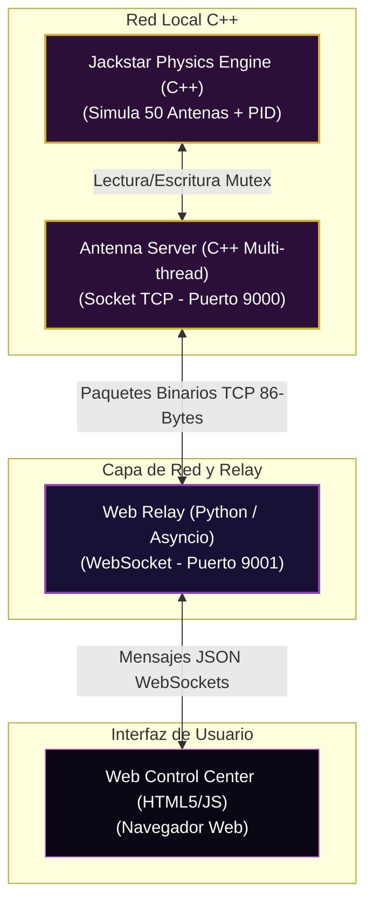

# AstroControlSim 📡✨

Un simulador de matriz de radiotelescopios de alto rendimiento desarrollado en **C++** y **Python**. Este proyecto simula los sistemas de control físico, protocolos binarios de red en tiempo real y visualización de datos utilizados en observatorios astronómicos profesionales de vanguardia (inspirado en la arquitectura de ALMA y VLA).

---

## 🚀 Características Principales

*   **Jackstar Engine (C++):** Simulación en tiempo real de una matriz de 50 antenas. Incorpora cálculo físico de inercia, aceleración y perfiles de velocidad trapezoidales.
*   **Concurrencia Segura (Nuevo):** Servidor multihilo protegido con exclusión mutua (`std::mutex`) para evitar condiciones de carrera en las lecturas/escrituras de estado del array.
*   **Protocolo TCP/IP Binario Sincronizado (Nuevo):** Comunicación en tiempo real basada en paquetes binarios estructurados de **86 bytes**. Se solucionó el desfase histórico de comunicación de red entre Python y C++ que causaba bloqueos de red (deadlocks).
*   **Bidirectional Web Relay (Nuevo):** Retransmisor asíncrono desarrollado en Python (`web_relay.py`) usando `asyncio` y `websockets`. Permite consultar telemetría a 10 Hz y reenviar comandos entrantes concurrentemente de manera segura.
*   **Web Control Center (Nuevo):** Interfaz web premium totalmente cableada. Los mandos de control de despacho de coordenadas y botones de parada de emergencia (`RESET`) interactúan directamente con la red física de antenas.
*   **Control de Lazo Cerrado (PID):** Sistema de control Proporcional-Integral-Derivado para posicionamiento preciso y amortiguación de perturbaciones por viento.
*   **Simulación de Interferometría:** Generación y desfase de señales complejas en tiempo real (Amplitud/Fase) basadas en la geometría del array en el plano UV.

---

## 🏛️ Arquitectura de Comunicación

El siguiente diagrama explica el flujo bidireccional de datos entre el hardware simulado en C++ y el centro de control web:


```mermaid
graph TD
    %% Styling
    classDef cpp fill:#2c0f38,stroke:#d4af37,stroke-width:2px,color:#fff;
    classDef python fill:#191135,stroke:#8e44ad,stroke-width:2px,color:#fff;
    classDef web fill:#0a0614,stroke:#da70d6,stroke-width:1px,color:#fff;
    
    A["Jackstar Physics Engine (C++)<br/>(Simula 50 Antenas + PID)"]
    B["Antenna Server (C++ Multi-thread)<br/>(Socket TCP - Puerto 9000)"]
    C["Web Relay (Python / Asyncio)<br/>(WebSocket - Puerto 9001)"]
    D["Web Control Center (HTML5/JS)<br/>(Navegador Web)"]
    
    A <-->|Lectura/Escritura Mutex| B
    B <-->|Paquetes Binarios TCP 86-Bytes| C
    C <-->|Mensajes JSON WebSockets| D
    
    class A cpp;
    class B cpp;
    class C python;
    class D web;
    
    %% Operational Flows
    subgraph Red Local C++
        A
        B
    end
    
    subgraph Capa de Red y Relay
        C
    end
    
    subgraph Interfaz de Usuario
        D
    end
```

---

## 🛠️ Guía de Instalación y Ejecución

### Prerrequisitos
1.  **C++ Compilador:** `GCC/MinGW-w64` con soporte para C++17.
2.  **Entorno Windows:** Si no tienes un compilador en tu variable de entorno `PATH`, puedes instalarlo ejecutando:
    ```powershell
    winget install MSYS2.MSYS2 --silent --accept-source-agreements --accept-package-agreements
    ```
    Y luego instala el toolchain de GCC abriendo una consola MSYS2 o ejecutando pacman:
    ```bash
    C:\msys64\usr\bin\bash.exe -lc "pacman -S --noconfirm mingw-w64-ucrt-x86_64-gcc mingw-w64-ucrt-x86_64-make"
    ```
    Añade `C:\msys64\ucrt64\bin` a tu variable de entorno `PATH`.

3.  **Python 3.11+:** Instala la biblioteca de WebSockets:
    ```powershell
    pip install websockets
    ```

### Compilación y Ejecución
1.  **Compilar el Servidor:**
    ```powershell
    mingw32-make
    ```
    *(Esto creará la carpeta `build/` con el ejecutable `JackstarObs.exe`)*

2.  **Lanzar la Simulación de Antenas:**
    ```powershell
    .\build\JackstarObs.exe
    ```

3.  **Iniciar el Web Relay (en otra terminal):**
    ```powershell
    python scripts/web_relay.py
    ```

4.  **Abrir el Panel de Control:**
    Abre el archivo [web/index.html](file:///C:/Users/pablo/Documentos/GitHub/AstroControlSim/web/index.html) en tu navegador preferido. ¡Ahora podrás enviar coordenadas directamente al array y monitorear la respuesta física en tiempo real!

---

## 📊 Estructura de Paquetes (86 Bytes)

Para evitar bloqueos y desalineaciones de red, toda la comunicación utiliza la siguiente estructura compactada:

| Campo | Tipo | Tamaño (Bytes) | Descripción |
| :--- | :--- | :--- | :--- |
| `type` | `uint8_t` | 1 | Tipo de Comando/Acción (1=MOVE, 3=TELEMETRY, 4=RESET) |
| `antennaId` | `uint32_t` | 4 | Identificador de la antena (0 = Broadcast/Todas) |
| `azimuth` | `double` | 8 | Coordenada Azimut (Grados / Destino) |
| `elevation` | `double` | 8 | Coordenada Elevación (Grados / Destino) |
| `azError` | `double` | 8 | Error de Azimut actual (PID input) |
| `elError` | `double` | 8 | Error de Elevación actual (PID input) |
| `posX` | `double` | 8 | Posición X física de la antena en el plano terrestre |
| `posY` | `double` | 8 | Posición Y física de la antena en el plano terrestre |
| `signalAmp` | `double` | 8 | Amplitud de la señal electromagnética captada |
| `signalPhase`| `double` | 8 | Fase de la señal electromagnética captada |
| `motorTemp` | `double` | 8 | Temperatura del motor de posicionamiento (IA Triage) |
| `motorCurrent`| `double`| 8 | Consumo de corriente del motor (IA Triage) |
| `state` | `uint8_t` | 1 | Estado actual de la antena (TRACKING, SLEWING, FAULT) |

---
*Desarrollado bajo el marco de ingeniería del Observatorio Virtual Autónomo y Sistemas de Adquisición Jackstar.*
