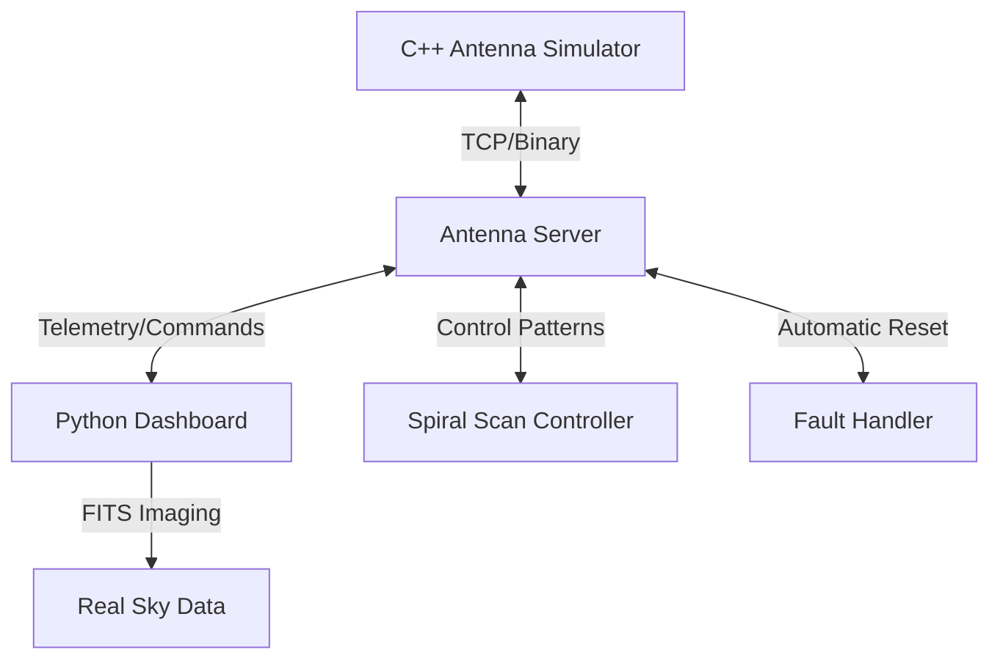

# AstroControlSim 📡✨

A high-performance radio telescope array simulator developed in C++ and Python. This project simulates the control systems, network protocols, and data visualization used in professional astronomical observatories like ALMA.

## Key Features 🚀

- **C++ Physics Engine**: Realistic 50-antenna array simulation with inertia, acceleration, and trapezoidal velocity profiles.
- **Custom TCP/IP Protocol**: Binary network layer for high-efficiency command dispatch and telemetry retrieval.
- **Professional Dashboard**: Real-time visualization using Python (`matplotlib`) and astronomical data processing (`astropy`).
- **"Virtual Telescope" Mode**: Integration of real astronomical FITS data (e.g., Horsehead Nebula) for signal detection simulation.
- **Chaos Engineering**: Built-in fault injection and an automated "Self-Healing" fault handler to simulate site operations.

## Architecture 🏛️



## Getting Started 🛠️

### Prerequisites
- **C++**: GCC/MinGW-w64 (support for C++17)
- **Python 3.12+**: `matplotlib`, `astropy`, `numpy`
- **Make**: To build the C++ server.

### Running the Simulation
1. **Build the Server**:
   ```powershell
   mingw32-make
   ```
2. **Launch the Components** (in separate terminals):
   - **Physics Engine**: `.\build\AstroControlSim.exe`
   - **Dashboard**: `python scripts/dashboard.py`
   - **Spiral Scan**: `python scripts/spiral_scan.py`
   - **Fault Handler**: `python scripts/fault_handler.py`

## Learning Objectives 🎓
- **Systems Programming**: Low-level C++, memory management, and binary protocols.
- **Distributed Systems**: Client-server architecture and asynchronous telemetry.
- **Astronomy Operations**: Azimuth/Elevation coordinates, FITS data handling, and fault management at scale.

---
*Created as part of a journey into Astronomical Observatory Engineering.*
